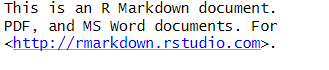

# essay

This is an R Markdown document. Markdown is a simple formatting syntax for authoring HTML, PDF, and MS Word documents. For more details on using R Markdown see <http://rmarkdown.rstudio.com>.

Uma imagem:




# question

This is a question about an hist(rnorm(10,0,1))


## keywords

ssss

more keywords


## answer


You can also embed plots, for example:

```{r pressure2, echo=FALSE}
plot(pressure)
```

Note that the `echo = FALSE` parameter was added to the code chunk to prevent printing of the R code that generated the plot.


# question


qqq


## keywords

ssss

## answer

You can also embed plots, for example:


Note that the `echo = FALSE` parameter was added to the code chunk to prevent printing of the R code that generated the plot.

# question

No ISCED/Cabinda  a disciplina de Estatística, as avaliações são divididas em três categorias: **Prova**, **Trabalho Prático** e **Participação em Sala de Aula**, com pesos respectivos de **5**, **3** e **2**. Um estudante  obteve as seguintes notas:Prova:**12,5**; Trabalho Prático: **12**; Participação em Sala de Aula : **9,5** . Calcule a média do estudante nessa disciplina" .

## keywords
Como cada nota possui um peso, trata-se  de uma média ponderada. A média ponderada é um tipo de média que leva em consideração a importância de cada valor ao calcular a média geral. Atribuindo um peso a cada valor, que indica sua importância relativa.

## answer
A média ponderada é calculada usando a forma:
\[
\bar x_p=\frac{Σ(w_ix_i)}{Σ(w_i)}
\]
Onde:
$w_i$ é o peso associado ao valor $x_i$; 
$Σ$  é o símbolo que representa a soma.
Calculando a média ponderada
$$
\bar x_p=\frac{Σ(w_ix_i)}{Σ(w_i)}
$$
$$
=\frac{(5.12,5+3.12+2.9,5)}{(5+3+2)}
$$
$$
=\frac{(62,5+36+19)}{10}
$$
$$
=\frac{(117,5)}{10}=11,75
$$
A média do estudante é: **11,75**